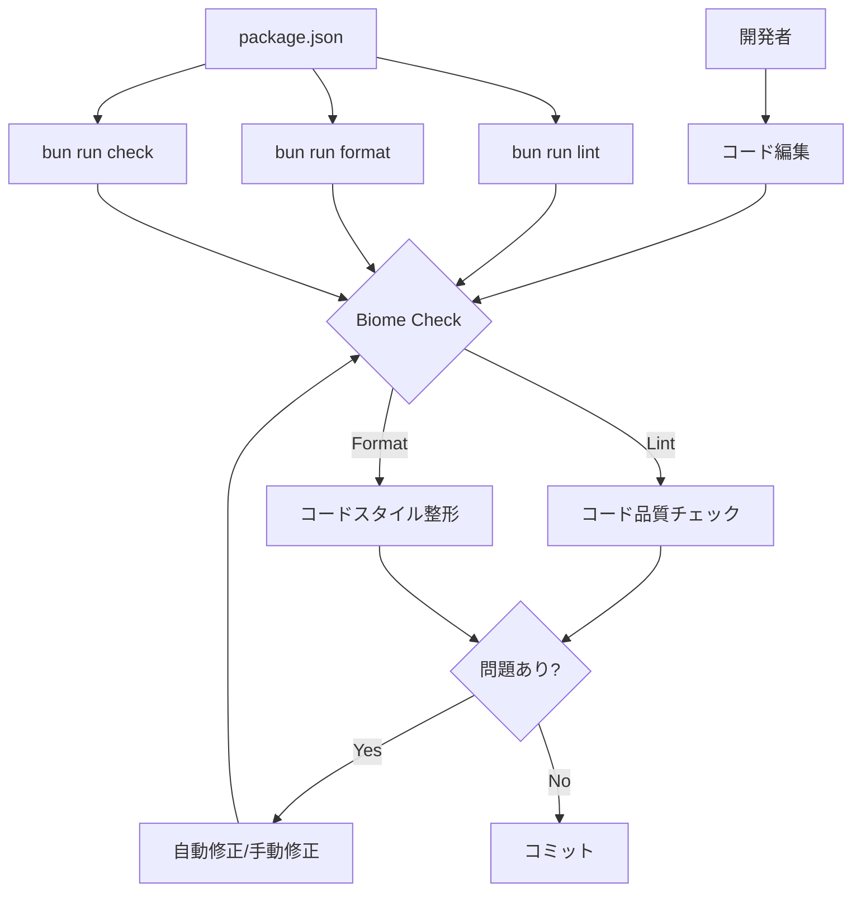

# Biome Linter導入設計書

## 概要

本ドキュメントは、docs-managerプロジェクトへのBiome（JavaScript/TypeScript用の高速リンター・フォーマッター）導入に関する設計書です。現在、プロジェクトにはLintingおよびFormattingツールが導入されておらず、コード品質の一貫性を保つための仕組みが不足しています。

Biomeは、RustベースのツールチェーンとしてESLintとPrettierの代替となる高速なリンター・フォーマッターです。単一のツールでLintingとFormattingの両方を提供し、Bunランタイムとの相性も良く、TypeScript strict modeが有効な本プロジェクトに最適です。

本導入により、コード品質の自動チェック、一貫したコードスタイルの維持、開発体験の向上を実現します。

## 背景

### 現状の課題

* Linting/Formattingツールの不在
	* プロジェクトには現在、コード品質をチェックするツールやフォーマッターが導入されていません
* コードスタイルの不統一
	* チーム開発において、コードスタイルが統一されていない可能性があります
* 潜在的なバグの見逃し
	* 静的解析による早期のバグ検出が行われていません
* 開発効率の低下
	* 手動でのコードレビューに時間がかかる可能性があります

### プロジェクトの技術スタック

* ランタイム: Bun
* 言語: TypeScript（strict mode 有効）
* プロジェクト構造: シンプル（メインファイル: `index.ts`）
* 既存ツール: ESLint、Prettier 等は未導入

### Biome を選択する理由

* 高速性
	* Rust ベースで、従来の JavaScript ツールより高速
* オールインワン
	* Linting + Formatting を単一ツールで提供
* Bun との相性
	* モダンな JavaScript ツールチェーンとの統合が良好
* TypeScript 対応
	* TypeScript strict mode との整合性が高い
* 設定のシンプルさ
	* 最小限の設定で強力な機能を利用可能

## ゴールと非ゴール

### ゴール

* Biomeをプロジェクトに導入し、Linting・Formatting環境を構築する
* 既存の`index.ts`に対してBiomeの推奨設定を適用する
* `package.json`にLint・Format・Checkスクリプトを追加する
* プロジェクトのコーディング規則を文書化する（CLAUDE.md更新）
* 導入プロセスを設計書として記録し、今後の参考とする

### 非ゴール

* カスタムLintルールの大量追加（推奨設定を基本とする）
* 既存コードの大規模リファクタリング（フォーマット以外の変更は行わない）
* CI/CDパイプラインへの組み込み（将来的な課題として残す）
* テストツールの導入（別タスクとする）

## 詳細設計

### アーキテクチャ概要



### 導入コンポーネント

#### 1. Biome 本体

* パッケージ: `@biomejs/biome`
* インストール方法: `bun add -D @biomejs/biome`
* バージョン: 2.3.4（導入時）

#### 2. 設定ファイル（biome.json）

基本構成:
```json
{
  "$schema": "https://biomejs.dev/schemas/2.3.4/schema.json",
  "vcs": {
    "enabled": true,
    "clientKind": "git",
    "useIgnoreFile": true
  },
  "files": {
    "ignoreUnknown": false,
    "includes": [
      "**",
      "!**/node_modules/",
      "!**/.serena/",
      "!**/.claude/",
      "!**/dist/",
      "!**/build/"
    ]
  },
  "formatter": {
    "enabled": true,
    "indentStyle": "tab",
    "indentWidth": 2,
    "lineWidth": 80
  },
  "linter": {
    "enabled": true,
    "rules": {
      "recommended": true
    }
  },
  "javascript": {
    "formatter": {
      "quoteStyle": "double",
      "semicolons": "always"
    }
  },
  "json": {
    "formatter": {
      "enabled": true
    }
  }
}
```

設定のポイント:

* VCS 統合
	* Git との統合を有効化し、`.gitignore` を尊重
* 除外ディレクトリ
	* `node_modules/`, `.serena/`, `.claude/` 等を除外
* フォーマッター
	* Biome デフォルトスタイル（タブインデント、セミコロンあり、ダブルクォート）
* リンター
	* 推奨ルールセットを有効化

#### 3. package.json スクリプト

追加するスクリプト:
```json
{
  "scripts": {
    "update": "bun run index.ts",
    "lint": "biome lint .",
    "format": "biome format --write .",
    "check": "biome check --write ."
  }
}
```

各スクリプトの役割:

* `lint`: Lint エラーのみをチェック（修正なし）
* `format`: フォーマットのみを実行
* `check`: Lint + Format を一括実行し、自動修正可能なものは修正

### ディレクトリ構造

導入後のプロジェクト構造:
```
/Users/k-shir0/Documents/k-shir0/docs-manager/
├── index.ts                 # メインファイル（Biomeで整形）
├── package.json             # スクリプト追加
├── biome.json              # 新規: Biome設定
├── tsconfig.json
├── CLAUDE.md               # 更新: コーディング規則追加
├── README.md
├── .gitignore
├── docs/
│   ├── design.md           # 新規: 本設計書
│   ├── design.md.sample
│   └── ...
└── .claude/
    └── ...
```

### データフロー

* 開発フロー
	```
	コード編集 → bun run check → 自動修正 → レビュー → コミット
	```
* 手動チェックフロー
	```
	コード編集 → bun run lint → 問題確認 → 手動修正 → コミット
	```
* フォーマットのみフロー
	```
	コード編集 → bun run format → 自動整形 → コミット
	```

### 既存コードへの影響

#### index.ts（308行）

実際の変更:

* Node.js ビルトインモジュールに `node:` プレフィックスを追加（`"path"` → `"node:path"`）
* 文字列連結をテンプレートリテラルに変換
* インデント、クォートスタイル、セミコロン、改行等のフォーマット統一

適用方法: `bun run check --write --unsafe` で自動修正完了

ロジックへの影響: なし（フォーマットとコーディングスタイルのみ）

## その他の関心事

### 実装フェーズ（実施済み）

#### Phase 1: 準備（設計書作成）✅

* 本設計書の作成と確認完了

#### Phase 2: Biome 導入✅

* `bun add -D @biomejs/biome` 実行完了（v2.3.4 インストール）
* `biome.json` 作成完了
* `bunx biome migrate --write` でスキーマバージョン更新完了
* `package.json` スクリプト追加完了

#### Phase 3: 既存コード整形✅

* `bun run check --write` 実行完了（4ファイル修正）
* `bun run check --write --unsafe` 実行完了（1ファイル追加修正）
* 変更内容確認完了

#### Phase 4: ドキュメント更新✅

* `CLAUDE.md` コーディング規則セクション更新完了
* `.gitignore` 更新は不要（Biome が自動的に `.gitignore` を尊重）

#### Phase 5: 検証✅

各スクリプトの動作確認完了:

* `bun run lint`: 正常動作確認
* `bun run format`: 正常動作確認
* `bun run check`: 正常動作確認

### 影響範囲

* コードベース
	* `index.ts`: フォーマット変更のみ（ロジックは不変）
	* `package.json`: フォーマット統一
	* `tsconfig.json`: フォーマット統一
* 開発ワークフロー
	* Lint/Format コマンドの追加
* ドキュメント
	* `CLAUDE.md` 更新、`docs/design.md` 追加
* 依存関係
	* `@biomejs/biome` v2.3.4 追加

### 導入結果

* チェック対象ファイル: 5ファイル
* 自動修正: 5ファイル（index.ts, package.json, tsconfig.json, biome.json, CLAUDE.md）
* 実行速度: 平均 5-27ms（非常に高速）
* 現在のステータス: すべてのファイルが Biome ルールに準拠

### 注意点

* 初回実行時の大量変更
	* ✅ 完了 - `index.ts` が初めてフォーマットされ、複数の変更が適用されました
* コミット戦略
	* フォーマット変更は別コミットとして記録することを推奨します
* チーム共有
	* Biome 導入後、チームメンバーに使用方法を共有する必要があります
* エディタ統合
	* VS Code 等のエディタで Biome 拡張機能のインストールを推奨（CLAUDE.md に記載済み）

### 今後の拡張性

* CI/CD パイプラインでの自動 Lint チェック
* Git hooks によるコミット前の自動チェック（Husky との統合）
* カスタム Lint ルールの追加
* より詳細なフォーマット設定のカスタマイズ

## 関連リンク

* [Biome 公式ドキュメント](https://biomejs.dev/)
* [Biome 設定リファレンス](https://biomejs.dev/reference/configuration/)
* [Biome と Prettier/ESLint の比較](https://biomejs.dev/guides/migrate-eslint-prettier/)
* [Bun ドキュメント](https://bun.sh/)
* [TypeScript strict mode](https://www.typescriptlang.org/tsconfig#strict)
