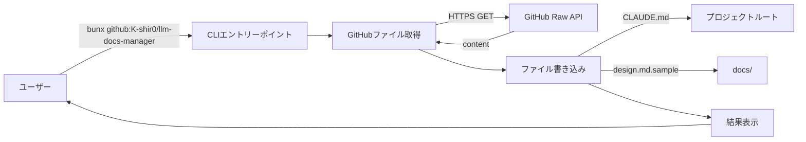
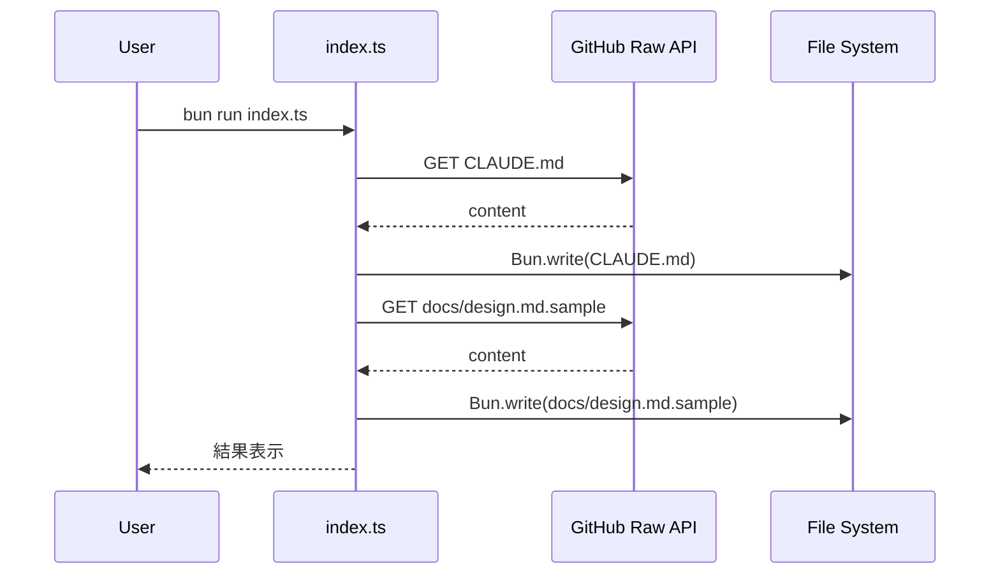

# GitHub テンプレート同期ツール

## 概要

本ツールは、GitHub リポジトリ ([K-shir0/docs-boilerplate-llm](https://github.com/K-shir0/docs-boilerplate-llm)) から最新のプロジェクトテンプレートファイルを取得し、現在のプロジェクトに自動反映します。

対象ファイル:
* `CLAUDE.md` * プロジェクト規則書
* `docs/design.md.sample` * 設計書テンプレート

目的:
* プロジェクトテンプレートの最新化を自動化
* 開発規約の統一性を保持
* 複数プロジェクト間での一貫性維持

## 背景

プロジェクトのコーディング規約や設計書テンプレートは、ベストプラクティスの進化に伴って更新が必要です。現在、[K-shir0/docs-boilerplate-llm](https://github.com/K-shir0/docs-boilerplate-llm) リポジトリで集中管理されているテンプレートを、各プロジェクトで手動同期するのは煩雑で更新漏れのリスクがあります。

このツールはテンプレート同期を自動化し、プロジェクト間での規約・設計書フォーマットの一貫性を保証します。

## ゴールと非ゴール

### ゴール

* GitHub Public API を使用して、認証なしで公開リポジトリからファイルを取得
* `CLAUDE.md` と `docs/design.md.sample` を自動更新
* `bunx github:K-shir0/llm-docs-manager` で簡単に実行可能
* 適切なエラーハンドリング（ネットワークエラー、ファイル取得失敗、レート制限など）
* 実行結果の明確な通知（成功/失敗、更新されたファイル）

### 非ゴール

* GitHub 認証（公開リポジトリのため不要）
* ファイルバックアップ機能（Git 版管理に委任）
* 差分表示や確認プロンプト（シンプルに上書き）
* ローカル変更の保護機能（上書きされる前提）
* 他のテンプレートファイルの同期（現時点では 2 ファイルのみ対応）
* 自動実行やスケジューリング（手動実行のみ）

## 技術仕様

### アーキテクチャ



### プロジェクト構成

```
docs-manager/
├── index.ts                       # メインロジック
├── package.json                   # パッケージ設定
├── tsconfig.json                  # TypeScript設定
├── bun.lock                       # 依存関係ロック
├── CLAUDE.md                      # 更新対象
├── docs/
│   ├── requirements/
│   │   └── template-sync.md      # 本要件定義
│   └── design.md.sample          # 更新対象
└── README.md
```

### データフロー



処理ステップ:
1. GitHub Raw Content API からファイル取得
	* エンドポイント: `https://raw.githubusercontent.com/K-shir0/docs-boilerplate-llm/main/{file_path}`
2. 取得内容をプロジェクト内の対応パスに上書き保存
3. 更新結果を標準出力に表示

### エラーハンドリング

| エラーケース | HTTP ステータス | 処理 |
|------------|--------------|------|
| ネットワークエラー | * | エラーメッセージ表示、終了コード 1 |
| ファイル未発見 | 404 | エラーメッセージ表示、処理継続 |
| レート制限超過 | 403 | レート制限メッセージ表示、終了 |
| タイムアウト | * | タイムアウトメッセージ表示、終了 |
| 書き込み失敗 | * | 権限エラー表示、終了 |

タイムアウト設定: 30 秒（AbortController 使用）

### 技術スタック

| 項目 | 技術 | 備考 |
|------|------|------|
| ランタイム | Bun 1.0 以降 | 必須 |
| HTTP クライアント | Bun 組み込み `fetch()` | 外部依存なし |
| ファイル I/O | Bun 組み込み `Bun.write()` / `Bun.file()` | 外部依存なし |
| 外部パッケージ | なし | Bun 標準 API のみ |

### package.json

```json
{
  "name": "docs-manager",
  "version": "0.1.0",
  "module": "index.ts",
  "type": "module",
  "private": true,
  "bin": {
    "docs-manager-update": "./index.ts"
  },
  "scripts": {
    "update": "bun run index.ts"
  },
  "devDependencies": {
    "@types/bun": "latest"
  },
  "peerDependencies": {
    "typescript": "^5"
  }
}
```

### 実装詳細

index.ts の主要機能:

* main() 関数
	* CLI エントリーポイント
	* 各ファイルの順次更新
	* 結果サマリー表示
	* 終了コード設定（成功: 0、失敗: 1）
* fetchFile() 関数
	* GitHub Raw API からファイル取得
	* URL: `https://raw.githubusercontent.com/K-shir0/docs-boilerplate-llm/main/{file_path}`
	* タイムアウト: 30 秒（AbortController）
	* 戻り値: 文字列またはエラー
* updateFile() 関数
	* プロジェクトルート相対パス計算
	* `Bun.write()` で UTF-8 書き込み
	* デバッグモード時の検証機能
* エラーハンドリング
	* HTTP ステータスコード分岐（404, 403 等）
	* タイムアウト検出（AbortError）
	* ユーザーフレンドリーなエラーメッセージ

## 使用方法

### 基本的な実行方法

方法 1: GitHub から直接実行（推奨）

```bash
bunx --bun github:K-shir0/llm-docs-manager
```

特徴:
* プロジェクトルート不要（どこからでも実行可能）
* GitHub 最新版を自動取得
* 他プロジェクトからも簡単に同期可能

キャッシュクリア:
```bash
# 最新版を確実に実行
bun pm cache rm && bunx --bun github:K-shir0/llm-docs-manager

# または --force フラグ使用
bunx --force --bun github:K-shir0/llm-docs-manager
```

方法 2: npm scripts で実行

```bash
bun run update
```

特徴:
* 最も簡潔
* プロジェクトルートで実行必須

方法 3: 直接実行

```bash
bun run index.ts
```

特徴:
* 最新コードを確実に実行
* プロジェクトルートで実行必須

### デバッグモード

問題調査時は `DEBUG=1` を設定:

```bash
DEBUG=1 bun run update
```

表示される情報:
* カレントワーキングディレクトリ
* ツールバージョン
* プロジェクトルートパス
* 取得元 URL
* コンテンツバイト数
* ファイル絶対パス
* 書き込み検証結果

## トラブルシューティング

### ファイルが更新されない

症状: ツールが「Updated」と表示するが、実際には変更されていない

原因: Bun キャッシュまたはファイルシステムの問題

解決策:
```bash
# デバッグモードで詳細確認
DEBUG=1 bun run update

# パーミッション確認
ls -la CLAUDE.md docs/design.md.sample
```

### bunx で古いバージョンが実行される

症状: GitHub を更新したのに古いバージョンが実行される

原因: bunx のキャッシュ

解決策:
```bash
# キャッシュクリア後に実行（推奨）
bun pm cache rm && bunx --bun github:K-shir0/llm-docs-manager

# --force フラグ使用
bunx --force --bun github:K-shir0/llm-docs-manager
```

### ネットワークエラー

症状: `Network error` または `Request timed out`

解決策:
* インターネット接続確認
* プロキシ設定確認
* GitHub アクセス可能か確認

### レート制限エラー

症状: `GitHub API rate limit exceeded`

原因: 認証なし API は 60 リクエスト/時間に制限

解決策: 1 時間待機後に再実行

## その他の考慮事項

### 実装の優先順位

1. Phase 1: 基本的なファイル取得・更新機能（本要件の範囲）
2. Phase 2: エラーハンドリングの充実化
3. Phase 3: オプション機能追加（--dry-run, --backup 等）

### 影響範囲

対象ユーザー: プロジェクトを運用する開発者

影響を受けるファイル:
* `CLAUDE.md` * プロジェクト規約（上書き）
* `docs/design.md.sample` * 設計書テンプレート（上書き）

注意事項: ローカル変更は失われるため、実行前に `git commit` を推奨

### セキュリティ

* 公開リポジトリからの取得（認証不要）
* HTTPS 通信による暗号化
* 書き込み先はプロジェクトルートに限定

### パフォーマンス

* GitHub Raw Content API レート制限: 60 リクエスト/時間（認証なし）
* 本ツールは 2 ファイルのみ取得のため、通常使用で問題なし

## 関連リンク

* [K-shir0/docs-boilerplate-llm](https://github.com/K-shir0/docs-boilerplate-llm) * テンプレートリポジトリ
* [GitHub Raw Content API](https://docs.github.com/en/rest/repos/contents) * API 仕様
* [Bun](https://bun.sh) * ランタイム
* [Bun fetch API](https://bun.sh/docs/api/fetch) * HTTP 通信
* [Bun File I/O](https://bun.sh/docs/api/file-io) * ファイル操作
