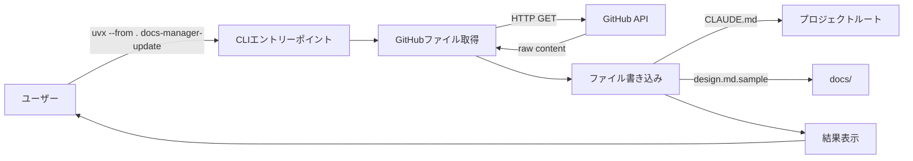
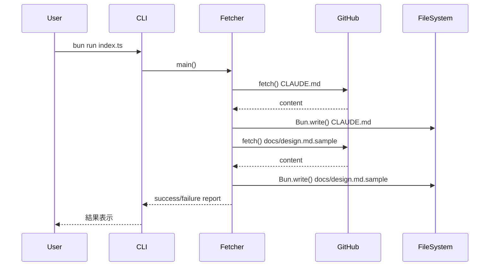

# GitHub テンプレート同期ツール

## 概要

* 本ドキュメントは、GitHub リポジトリ ([K-shir0/docs-boilerplate-llm](https://github.com/K-shir0/docs-boilerplate-llm)) から最新のプロジェクトテンプレートファイルを取得し、現在のプロジェクトに自動反映するツールの要件を定義します。
* 対象となるテンプレートファイルは `CLAUDE.md` (プロジェクト規則書) と `docs/design.md.sample` (設計書テンプレート) の2つです。
* このツールは `uvx` コマンドで実行可能な Python スクリプトとして実装され、プロジェクトテンプレートの最新化を自動化し、開発規約の統一性を保つことを目的とします。

## 背景

* プロジェクトのコーディング規約や設計書テンプレートは、ベストプラクティスの進化に伴って更新される必要があります。
* 現在、[K-shir0/docs-boilerplate-llm](https://github.com/K-shir0/docs-boilerplate-llm) リポジトリでプロジェクトテンプレートが管理されており、複数のプロジェクトで共通して使用されています。
* テンプレートが更新された際、各プロジェクトで手動で最新版を取得・反映する作業は煩雑であり、更新漏れのリスクがあります。
* このツールは、テンプレートファイルの同期を自動化し、プロジェクト間での規約・設計書フォーマットの一貫性を保つことを可能にします。
* このドキュメントでは、テンプレートファイルの取得・更新機能に焦点を当て、実装方法とユーザーインターフェースを定義します。

## ゴールと非ゴール

### ゴール

* GitHub Public API を使用して、認証なしで公開リポジトリからファイルを取得する
* `CLAUDE.md` と `docs/design.md.sample` の2つのファイルを自動的に更新する
* `uvx --from . docs-manager-update` のようなコマンドで簡単に実行できるようにする
* Python パッケージとして適切に構成し、pyproject.toml で管理する
* エラーハンドリング（ネットワークエラー、ファイル取得失敗、レート制限など）を実装する
* 実行結果（成功/失敗、更新されたファイル）をユーザーに明確に通知する

### 非ゴール

* GitHub 認証（Personal Access Token）の実装（公開リポジトリのため不要）
* ファイル更新時のバックアップ作成（git による版管理に委任）
* 差分表示や確認プロンプトの実装（シンプルに上書き）
* カスタマイズされた部分の保護機能（ユーザーがローカルで変更した内容は上書きされる前提）
* 他のテンプレートファイルの同期（現時点では `CLAUDE.md` と `docs/design.md.sample` のみ）
* 自動実行やスケジューリング機能（手動実行のみ）

## 詳細設計

### アーキテクチャ



### コンポーネント設計

#### 1. プロジェクト構成

```
docs-manager/
├── index.ts                       # メインロジック（エントリーポイント）
├── docs/
│   ├── requirements/
│   │   └── template-sync.md      # 本要件定義書
│   └── design.md.sample          # 更新対象
├── CLAUDE.md                      # 更新対象
├── package.json                   # プロジェクト設定
├── tsconfig.json                  # TypeScript設定
├── bun.lock                       # 依存関係ロックファイル
└── README.md
```

#### 2. データフロー

1. **ユーザー実行**: `bun run index.ts` を実行
2. **GitHub API 呼び出し**:
   - エンドポイント: `https://raw.githubusercontent.com/K-shir0/docs-boilerplate-llm/main/{file_path}`
   - 対象ファイル:
     - `CLAUDE.md`
     - `docs/design.md.sample`
3. **ファイル書き込み**: 取得した内容をプロジェクトの対応するパスに上書き保存
4. **結果表示**: 更新されたファイル名と成功/失敗を標準出力に表示

#### 3. エラーハンドリング

| エラーケース | 処理 |
|------------|------|
| ネットワークエラー | エラーメッセージを表示し、終了コード 1 で終了 |
| ファイル取得失敗 (404) | 該当ファイルが見つからない旨を表示し、継続または終了 |
| レート制限超過 (403) | レート制限に達した旨を表示し、終了 |
| ファイル書き込み失敗 | 権限エラー等を表示し、終了 |

#### 4. 依存関係

* **ランタイム**: Bun 1.0以降
* **HTTP クライアント**: Bun組み込みの `fetch()` API使用（外部依存なし）
* **ファイルI/O**: Bun組み込みの `Bun.write()` / `Bun.file()` 使用
* **外部パッケージ**: 不要（Bunの標準APIのみで動作）

#### 5. package.json 設定

```json
{
  "name": "docs-manager",
  "version": "0.1.0",
  "module": "index.ts",
  "type": "module",
  "private": true,
  "bin": {
    "docs-manager-update": "./index.ts"
  },
  "devDependencies": {
    "@types/bun": "latest"
  },
  "peerDependencies": {
    "typescript": "^5"
  }
}
```

### 実行フロー



### 実装の詳細

#### index.ts の主要機能

1. **main() 関数**: CLI エントリーポイント
   - 各ファイルの更新を順次実行
   - 結果をサマリー表示
   - 終了コード設定（成功: 0、失敗: 1）

2. **fetchFile() 関数**: GitHub からファイルを取得
   - URL: `https://raw.githubusercontent.com/K-shir0/docs-boilerplate-llm/main/{file_path}`
   - 使用API: Bun組み込みの `fetch()`
   - タイムアウト設定: 30秒（AbortController使用）
   - 戻り値: ファイル内容（文字列）またはエラー

3. **updateFile() 関数**: ローカルファイルに書き込み
   - プロジェクトルートからの相対パスを計算
   - Bun.write() でファイル書き込み
   - 書き込み検証機能（デバッグモード）
   - ファイル内容を UTF-8 で書き込み

4. **エラーハンドリング**:
   - HTTPステータスコードによる分岐（404, 403等）
   - AbortErrorによるタイムアウト検出
   - 例外処理とユーザーフレンドリーなメッセージ

## その他の関心事

### 実装の優先順位

1. **Phase 1**: 基本的なファイル取得・更新機能の実装（本要件定義の範囲）
2. **Phase 2**: エラーハンドリングの充実化
3. **Phase 3**: オプション機能の追加（--dry-run, --backup など）

### 影響範囲

* **ユーザー**: プロジェクトを運用する開発者
* **影響を受けるファイル**:
  - `CLAUDE.md` - プロジェクト規約（上書きされる）
  - `docs/design.md.sample` - 設計書テンプレート（上書きされる）
* **注意事項**: ローカルでカスタマイズした内容は失われるため、実行前に git commit を推奨

### セキュリティ考慮事項

* 公開リポジトリからの取得のため、認証情報の管理は不要
* HTTPS 通信による暗号化
* ファイル書き込み先はプロジェクトルートに限定（パストラバーサル対策は不要）

### パフォーマンス

* GitHub の raw content API はレート制限あり（認証なし: 60リクエスト/時間）
* 本ツールは2ファイルのみ取得するため、通常使用では問題なし

### 実行方法

#### 推奨方法1（GitHubから直接実行 - bunx）

```bash
bunx --bun github:K-shir0/docs-manager
```

この方法では：
- プロジェクトルートにいる必要がない（どこからでも実行可能）
- GitHubの最新版を自動的に取得して実行
- 他のプロジェクトから簡単にテンプレートを同期できる
- **注意**: GitHubにpush済みである必要がある

#### 推奨方法2（npm scripts）

```bash
bun run update
```

この方法では：
- 最も簡潔なコマンド
- package.jsonのscriptsを使用
- プロジェクトルートで実行する必要がある

#### 推奨方法3（直接実行）

```bash
bun run index.ts
```

この方法では：
- 最新のコードが確実に実行される
- 依存関係が自動的にインストールされる
- プロジェクトルートで実行する必要がある

#### デバッグモード

問題調査時は環境変数 `DEBUG=1` を設定してください：

```bash
DEBUG=1 bun run update
# または
DEBUG=1 bun run index.ts
```

デバッグモードでは以下の情報が表示されます：
- プロジェクトルートのパス
- 取得元URL
- 取得したコンテンツのバイト数
- 書き込み先ファイルの絶対パス
- ファイルの存在確認
- 既存/新規コンテンツのバイト数
- 内容の差異の有無
- 書き込み検証結果

### トラブルシューティング

#### ファイルが更新されない

**症状**: ツールが「Updated」と表示するが、実際にファイルが変更されていない

**原因**: Bunのキャッシュまたはファイルシステムの問題

**解決策**:
```bash
# デバッグモードで実行して詳細を確認
DEBUG=1 bun run update

# 書き込み検証が失敗する場合はファイルのパーミッションを確認
ls -la CLAUDE.md docs/design.md.sample
```

#### ネットワークエラー

**症状**: `Network error` または `Request timed out`

**解決策**:
- インターネット接続を確認
- プロキシ設定を確認
- GitHub へのアクセスが可能か確認

#### レート制限エラー

**症状**: `GitHub API rate limit exceeded`

**原因**: 認証なしの GitHub API は 60リクエスト/時間 に制限されている

**解決策**: 1時間待ってから再実行

## 関連リンク

* [K-shir0/docs-boilerplate-llm リポジトリ](https://github.com/K-shir0/docs-boilerplate-llm)
* [GitHub Raw Content API](https://docs.github.com/en/rest/repos/contents)
* [Bun - JavaScriptランタイム](https://bun.sh)
* [Bun fetch API](https://bun.sh/docs/api/fetch)
* [Bun File I/O](https://bun.sh/docs/api/file-io)
