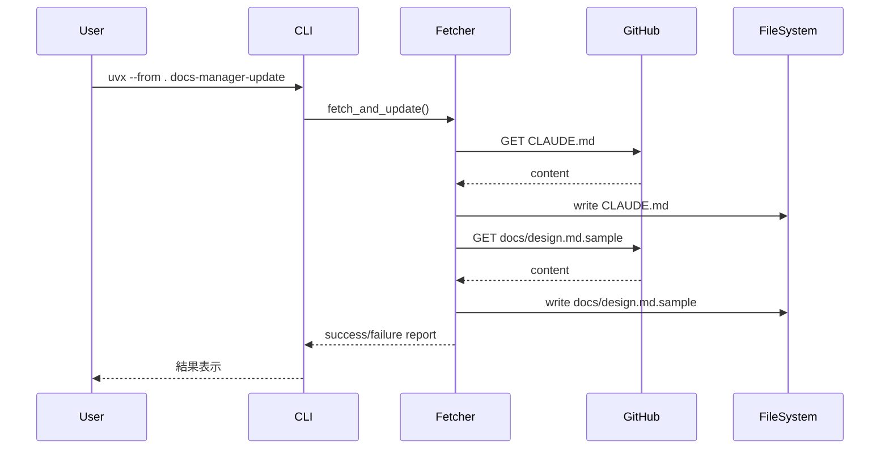

# GitHub テンプレート同期ツール

## 概要

* 本ドキュメントは、GitHub リポジトリ ([K-shir0/docs-boilerplate-llm](https://github.com/K-shir0/docs-boilerplate-llm)) から最新のプロジェクトテンプレートファイルを取得し、現在のプロジェクトに自動反映するツールの要件を定義します。
* 対象となるテンプレートファイルは `CLAUDE.md` (プロジェクト規則書) と `docs/design.md.sample` (設計書テンプレート) の2つです。
* このツールは `uvx` コマンドで実行可能な Python スクリプトとして実装され、プロジェクトテンプレートの最新化を自動化し、開発規約の統一性を保つことを目的とします。

## 背景

* プロジェクトのコーディング規約や設計書テンプレートは、ベストプラクティスの進化に伴って更新される必要があります。
* 現在、[K-shir0/docs-boilerplate-llm](https://github.com/K-shir0/docs-boilerplate-llm) リポジトリでプロジェクトテンプレートが管理されており、複数のプロジェクトで共通して使用されています。
* テンプレートが更新された際、各プロジェクトで手動で最新版を取得・反映する作業は煩雑であり、更新漏れのリスクがあります。
* このツールは、テンプレートファイルの同期を自動化し、プロジェクト間での規約・設計書フォーマットの一貫性を保つことを可能にします。
* このドキュメントでは、テンプレートファイルの取得・更新機能に焦点を当て、実装方法とユーザーインターフェースを定義します。

## ゴールと非ゴール

### ゴール

* GitHub Public API を使用して、認証なしで公開リポジトリからファイルを取得する
* `CLAUDE.md` と `docs/design.md.sample` の2つのファイルを自動的に更新する
* `uvx --from . docs-manager-update` のようなコマンドで簡単に実行できるようにする
* Python パッケージとして適切に構成し、pyproject.toml で管理する
* エラーハンドリング（ネットワークエラー、ファイル取得失敗、レート制限など）を実装する
* 実行結果（成功/失敗、更新されたファイル）をユーザーに明確に通知する

### 非ゴール

* GitHub 認証（Personal Access Token）の実装（公開リポジトリのため不要）
* ファイル更新時のバックアップ作成（git による版管理に委任）
* 差分表示や確認プロンプトの実装（シンプルに上書き）
* カスタマイズされた部分の保護機能（ユーザーがローカルで変更した内容は上書きされる前提）
* 他のテンプレートファイルの同期（現時点では `CLAUDE.md` と `docs/design.md.sample` のみ）
* 自動実行やスケジューリング機能（手動実行のみ）

## 詳細設計

### アーキテクチャ


### コンポーネント設計

#### 1. プロジェクト構成

```
docs-manager/
├── src/
│   └── docs_manager/
│       ├── __init__.py           # パッケージ初期化
│       └── update.py             # メインロジック
├── docs/
│   ├── requirements/
│   │   └── template-sync.md      # 本要件定義書
│   └── design.md.sample          # 更新対象
├── CLAUDE.md                      # 更新対象
├── pyproject.toml                 # プロジェクト設定
└── README.md
```

#### 2. データフロー

1. **ユーザー実行**: `uvx --from . docs-manager-update` を実行
2. **GitHub API 呼び出し**:
   - エンドポイント: `https://raw.githubusercontent.com/K-shir0/docs-boilerplate-llm/main/{file_path}`
   - 対象ファイル:
     - `CLAUDE.md`
     - `docs/design.md.sample`
3. **ファイル書き込み**: 取得した内容をプロジェクトの対応するパスに上書き保存
4. **結果表示**: 更新されたファイル名と成功/失敗を標準出力に表示

#### 3. エラーハンドリング

| エラーケース | 処理 |
|------------|------|
| ネットワークエラー | エラーメッセージを表示し、終了コード 1 で終了 |
| ファイル取得失敗 (404) | 該当ファイルが見つからない旨を表示し、継続または終了 |
| レート制限超過 (403) | レート制限に達した旨を表示し、終了 |
| ファイル書き込み失敗 | 権限エラー等を表示し、終了 |

#### 4. 依存関係

* **HTTP クライアント**: `httpx` (モダンな async 対応 HTTP ライブラリ)
* **ビルドシステム**: `hatchling` (uv と相性が良い)
* **Python バージョン**: >=3.11.10 (既存の .python-version に準拠)

#### 5. pyproject.toml 設定

```toml
[project]
name = "docs-manager"
version = "0.1.0"
requires-python = ">=3.11.10"
dependencies = [
    "httpx>=0.27.0",
]

[project.scripts]
docs-manager-update = "docs_manager.update:main"

[build-system]
requires = ["hatchling"]
build-backend = "hatchling.build"
```

### 実行フロー



### 実装の詳細

#### update.py の主要機能

1. **main() 関数**: CLI エントリーポイント
   - 引数解析（将来的な拡張に備え、必要に応じて実装）
   - 各ファイルの更新を順次実行
   - 結果をサマリー表示

2. **fetch_file() 関数**: GitHub からファイルを取得
   - URL: `https://raw.githubusercontent.com/K-shir0/docs-boilerplate-llm/main/{file_path}`
   - タイムアウト設定: 30秒
   - 戻り値: ファイル内容（文字列）またはエラー

3. **update_file() 関数**: ローカルファイルに書き込み
   - プロジェクトルートからの相対パスを計算
   - 必要に応じてディレクトリを作成
   - ファイル内容を UTF-8 で書き込み

4. **エラーハンドリング**:
   - HTTPステータスコードによる分岐
   - 例外処理とユーザーフレンドリーなメッセージ

## その他の関心事

### 実装の優先順位

1. **Phase 1**: 基本的なファイル取得・更新機能の実装（本要件定義の範囲）
2. **Phase 2**: エラーハンドリングの充実化
3. **Phase 3**: オプション機能の追加（--dry-run, --backup など）

### 影響範囲

* **ユーザー**: プロジェクトを運用する開発者
* **影響を受けるファイル**:
  - `CLAUDE.md` - プロジェクト規約（上書きされる）
  - `docs/design.md.sample` - 設計書テンプレート（上書きされる）
* **注意事項**: ローカルでカスタマイズした内容は失われるため、実行前に git commit を推奨

### セキュリティ考慮事項

* 公開リポジトリからの取得のため、認証情報の管理は不要
* HTTPS 通信による暗号化
* ファイル書き込み先はプロジェクトルートに限定（パストラバーサル対策は不要）

### パフォーマンス

* GitHub の raw content API はレート制限あり（認証なし: 60リクエスト/時間）
* 本ツールは2ファイルのみ取得するため、通常使用では問題なし

### 実行方法

#### 推奨方法（uv run）

```bash
uv run python -m docs_manager.update
```

この方法では：
- 最新のコードが確実に実行される
- 依存関係が自動的にインストールされる
- プロジェクトルートで実行する必要がある

#### 代替方法（uvx）

```bash
uvx --from . docs-manager-update
```

**注意**: uvx はキャッシュを使用するため、コード変更後は古いバージョンが実行される可能性があります。

#### デバッグモード

問題調査時は環境変数 `DEBUG=1` を設定してください：

```bash
DEBUG=1 uv run python -m docs_manager.update
```

デバッグモードでは以下の情報が表示されます：
- プロジェクトルートのパス
- 書き込み先ファイルの絶対パス
- ファイルの存在確認
- 既存/新規コンテンツのバイト数
- 内容の差異の有無
- 書き込み検証結果

### トラブルシューティング

#### ファイルが更新されない

**症状**: ツールが「Updated」と表示するが、実際にファイルが変更されていない

**原因**: uvx がキャッシュされた古いバージョンを実行している

**解決策**:
```bash
# 方法1: uv run を使用（推奨）
uv run python -m docs_manager.update

# 方法2: キャッシュをクリア
uv cache clean
uvx --from . docs-manager-update
```

#### httpx モジュールが見つからない

**症状**: `ModuleNotFoundError: No module named 'httpx'`

**原因**: Python環境に httpx がインストールされていない

**解決策**: `uv run` を使用してください（依存関係を自動管理）

#### ネットワークエラー

**症状**: `Network error` または `Request timed out`

**解決策**:
- インターネット接続を確認
- プロキシ設定を確認
- GitHub へのアクセスが可能か確認

#### レート制限エラー

**症状**: `GitHub API rate limit exceeded`

**原因**: 認証なしの GitHub API は 60リクエスト/時間 に制限されている

**解決策**: 1時間待ってから再実行

## 関連リンク

* [K-shir0/docs-boilerplate-llm リポジトリ](https://github.com/K-shir0/docs-boilerplate-llm)
* [GitHub Raw Content API](https://docs.github.com/en/rest/repos/contents)
* [uv - Python パッケージマネージャー](https://github.com/astral-sh/uv)
* [httpx ドキュメント](https://www.python-httpx.org/)
